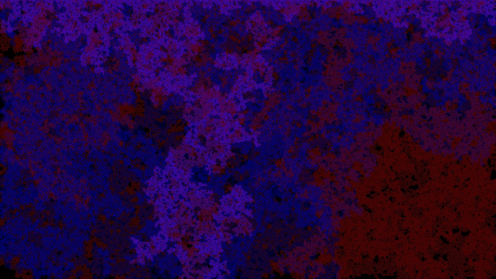

# Percolation
Various percolation strategies: 3/4/6/8 neighbors, randomized vertices vs. edges.

Some installation clues in case of trouble:
* opam install lablgtk

## 4 neighbors, randomized vertices

