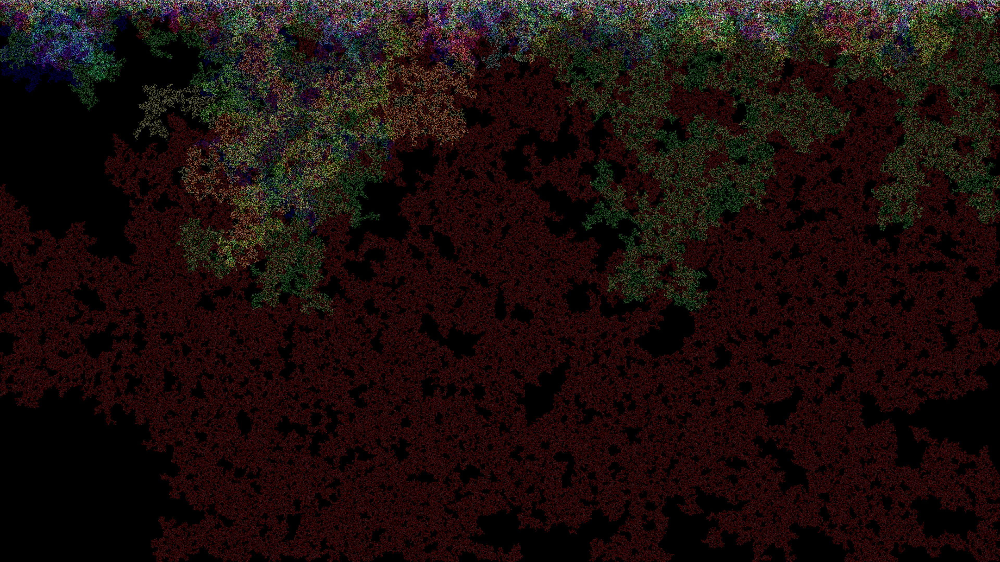
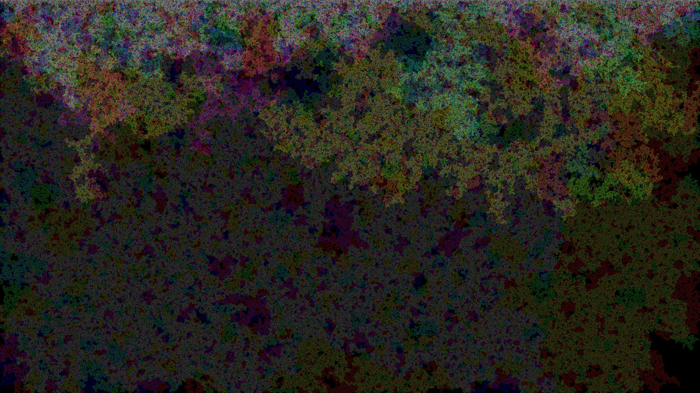
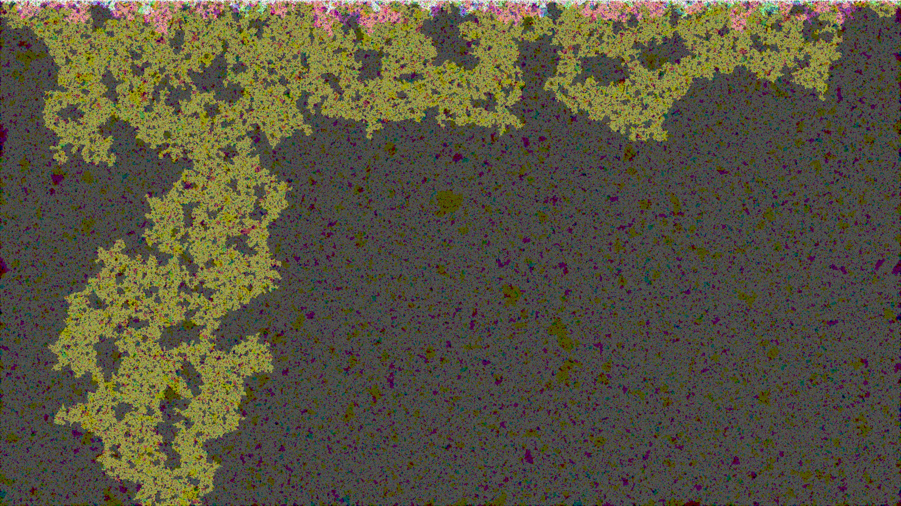
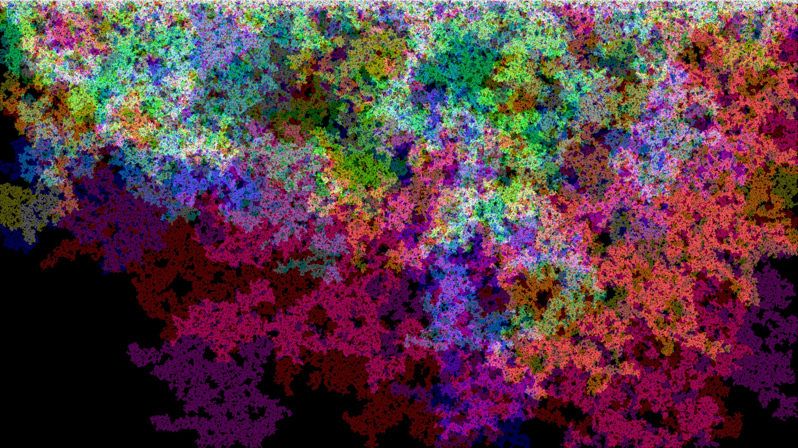
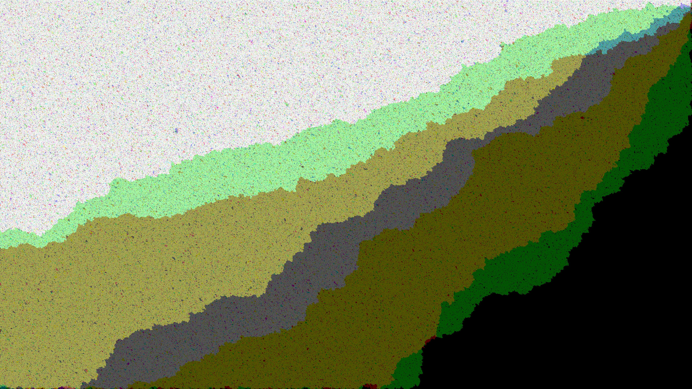
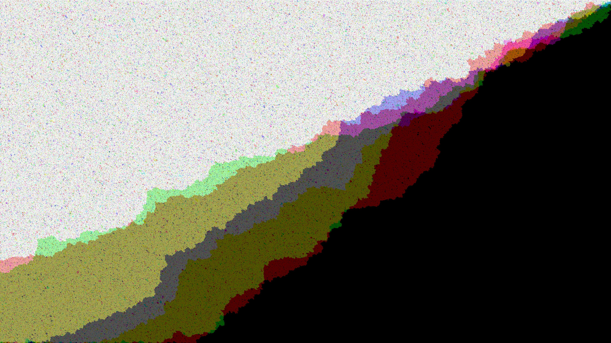

# Percolation
Various percolation strategies: 3/4/6/8 neighbors, randomized vertices vs. edges.

Some installation clues in case of trouble:
* opam install lablgtk

The generated images use 6 independent layers of percolation.

## 4 neighbors, randomized vertices

## 8 neighbors, randomized vertices

## 8 neighbors, randomized edges

## 4 neighbors, randomized edges

